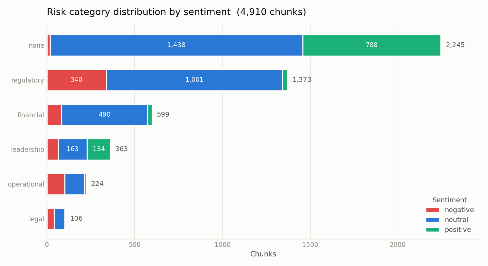
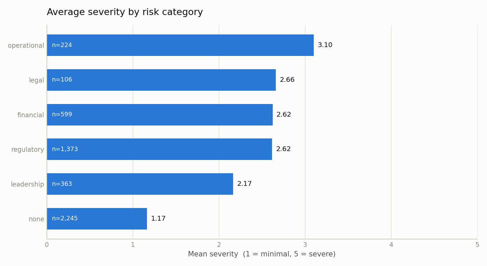
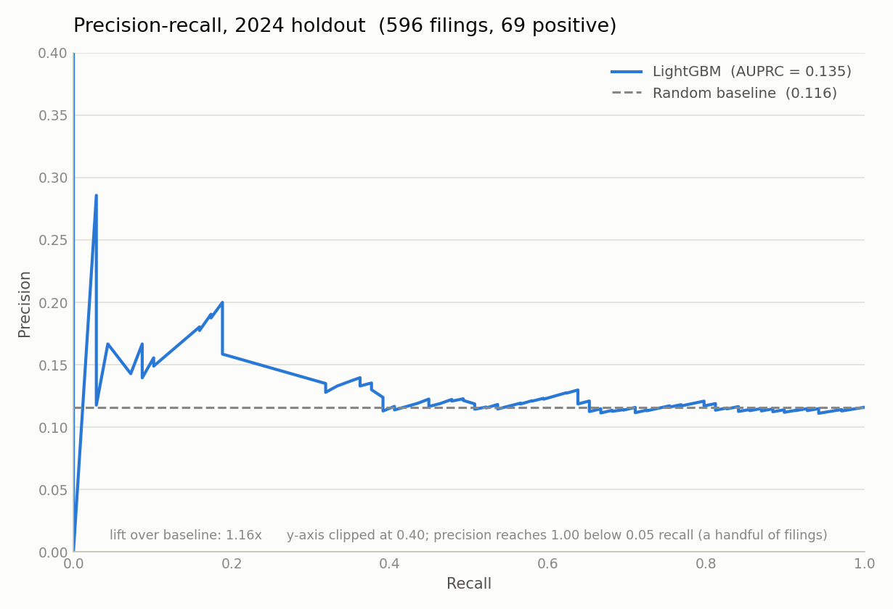

# Fintech Risk Intelligence

An end-to-end pipeline that pulls 8-K filings from SEC EDGAR, extracts structured risk signals with a locally-hosted LLM, builds a semantic retrieval layer over 4,910 filing chunks, and tests whether any of it predicts short-horizon market underperformance — with an out-of-time holdout and an honest negative result.

---

## The Problem

An 8-K is the SEC form a public company files when something material happens between quarterly reports: an executive resigns, a plant burns down, a regulator issues a subpoena, a merger closes. Roughly 2,500 of them land for the S&P 100 alone in a four-year window. Each one is unstructured prose wrapped in near-identical legal boilerplate, and the interesting content is a few sentences buried inside it.

Three things make this genuinely hard, and most write-ups skip past all three:

**The signal-to-noise ratio is brutal.** The cover page, checkbox section, registered-securities table and signature block of an 8-K are byte-for-byte formulaic. In this corpus, stripping that boilerplate removes a large fraction of every document before any analysis can start. What survives is often a single sentence of substance plus an exhibit index.

**Labels are contaminated by market beta.** The obvious target — "did the stock drop 10% in the next 90 days?" — mostly measures whether the *market* fell. This project built that label first and measured the damage: it flagged **22.6% of 2022 filings** as negative events versus ~8% in every other year. A model trained on it would learn "it is 2022," and out-of-time validation would then collapse. Replacing it with a market-relative label (excess return versus SPY) cut 2022 to **9.9%**, in line with 2021 (7.7%), 2023 (7.5%) and 2024 (11.6%).

**Leakage hides in the retrieval layer.** Chunks from the same filing overlap by 50 tokens, so a chunk's nearest semantic neighbours are usually its own siblings. For one 17-chunk Broadcom filing, 3 of the top 5 neighbours were the same document — the filing describing itself.

The gap this project addresses is not "can an LLM read a filing" — it obviously can. It is whether the structured output of a small local LLM, aggregated to filing level and enriched with semantic neighbours, carries information about near-term price moves **once the methodology is tight enough that you would believe a positive result.** That required fixing the label, fixing the leakage, and running a strict chronological holdout. The answer, reported in full below, is no.

---

## Pipeline Architecture

```
┌───────────────────────────────────────────────────────────────────────────┐
│ 1  COLLECT            src/collect.py                                      │
│    SEC EDGAR full-text search API → 50 large-cap US issuers, 2021–2024     │
│    Out: 2,553 filings · data/raw/filings/*.txt + filings_metadata.csv      │
└───────────────────────────────────────────────────────────────────────────┘
                                    ▼
┌───────────────────────────────────────────────────────────────────────────┐
│ 2  CLEAN & CHUNK      src/clean.py                                        │
│    Strip SEC cover page + signature block · normalise whitespace           │
│    Chunk at 500 tiktoken tokens, 50 overlap                               │
│    Out: 4,910 chunks · data/cleaned/chunks.csv                            │
└───────────────────────────────────────────────────────────────────────────┘
                                    ▼
┌───────────────────────────────────────────────────────────────────────────┐
│ 3  EXTRACT            src/extract.py          ← local LLM, no API cost     │
│    Ollama · Phi-3 Mini (3.8B, q4) · JSON mode · 1 call per chunk           │
│    risk_category · sentiment · severity 1–5 · forward-looking · entities   │
│    Out: 4,910 rows · 72 malformed (1.5%), handled with safe defaults       │
└───────────────────────────────────────────────────────────────────────────┘
                                    ▼
┌───────────────────────────────────────────────────────────────────────────┐
│ 4  EMBED              src/embed.py                                        │
│    sentence-transformers all-mpnet-base-v2 · 768-dim · CUDA                │
│    Out: 4,910 vectors in ChromaDB (81 MB, cosine) + 7 metadata fields      │
└───────────────────────────────────────────────────────────────────────────┘
                                    ▼
┌───────────────────────────────────────────────────────────────────────────┐
│ 5  RETRIEVE           src/retrieve.py         ← leakage guard lives here   │
│    Over-fetch 50 candidates → drop same-company → keep top 5 survivors     │
│    Out: similar_count · avg_severity_nb · dominant_cat_nb · neg_ratio_nb   │
└───────────────────────────────────────────────────────────────────────────┘
                                    ▼
┌───────────────────────────────────────────────────────────────────────────┐
│ 6  FEATURES & LABEL   src/features.py                                     │
│    Aggregate chunks → filing level (keyed on accession number)             │
│    yfinance: stock vs SPY, 5 trading days → excess return < −5%            │
│    Out: 2,553 × 20 matrix · 233 positives (9.13%), 1:10 imbalance          │
└───────────────────────────────────────────────────────────────────────────┘
                                    ▼
┌───────────────────────────────────────────────────────────────────────────┐
│ 7  TRAIN & EVALUATE   src/train.py · src/visualise.py                     │
│    LightGBM · Optuna 50 trials · 3-fold CV on AUPRC · scale_pos_weight=10  │
│    OUT-OF-TIME split: train 2021–2023 (1,957) → test 2024 (596)            │
│    Out: models/lgbm_model.pkl + 3 charts                                   │
└───────────────────────────────────────────────────────────────────────────┘
                                    ▼
┌───────────────────────────────────────────────────────────────────────────┐
│ 8  SERVE              api/main.py                                         │
│    FastAPI · GET /health · POST /score (raw filing text → risk_score)      │
│    Runs stages 2–7 inline on one document · ~5s per chunk                  │
└───────────────────────────────────────────────────────────────────────────┘
```

---

## Tech Stack

| Layer | Tool | Version | Why this one |
|---|---|---|---|
| Ingestion | SEC EDGAR full-text search API | — | Free, authoritative, no vendor data licence |
| HTML parsing | BeautifulSoup + lxml | 4.12.3 | Inline-XBRL filings need `<ix:header>` stripped, not regex |
| Tokenisation | tiktoken (`cl100k_base`) | 0.14.0 | Exact token counts for chunking, not word-count proxies |
| LLM extraction | Ollama + Phi-3 Mini (3.8B, q4) | 0.34.2 | Runs locally on 4 GB VRAM; zero API cost over 4,910 calls |
| Embeddings | sentence-transformers `all-mpnet-base-v2` | 6.1.0 | 768-dim, strong retrieval benchmark scores |
| GPU runtime | PyTorch (CUDA 12.8) | 2.11.0+cu128 | RTX 3050; full corpus embeds in 2m56s |
| Vector store | ChromaDB | 1.5.9 | Persistent, metadata filtering (`$gte` on severity) |
| Market data | yfinance | 1.7.0 | Daily closes for 50 issuers + SPY benchmark |
| Model | LightGBM | 4.7.0 | Handles NaN natively; fast on tabular + one-hot |
| Tuning | Optuna (TPE) | 4.9.0 | 50-trial Bayesian search over 10 hyperparameters |
| Serving | FastAPI + Uvicorn | 0.140.1 | Async, Pydantic validation, auto OpenAPI docs |
| Charts | matplotlib | 3.9.2 | CVD-validated palette, static PNG output |
| Runtime | Python | 3.12.0 | — |

---

## Key Findings

### The extraction layer works, and its output is internally coherent

Severity scores track risk category in the direction you would expect, which is evidence the small local model is doing real work rather than emitting noise:

| Risk category | Mean severity | Chunks |
|---|---|---|
| operational | **3.10** | 224 |
| legal | 2.66 | 106 |
| financial | 2.62 | 599 |
| regulatory | 2.62 | 1,373 |
| leadership | 2.17 | 363 |
| none | **1.17** | 2,245 |





The `none` bucket scoring 1.17 against operational's 3.10 is the ordering a domain expert would predict. Sentiment lines up too: **regulatory chunks carry 340 of the 652 negative-sentiment chunks** (52% of all negative sentiment, from 28% of chunks), the single strongest category-sentiment association in the corpus.

### The market-relative label removed a real confound

Measured side by side on identical filings:

| Year | Absolute 10% / 90d | Excess vs SPY, 5d |
|---|---|---|
| 2021 | 8.0% | 7.7% |
| 2022 | **22.6%** | **9.9%** |
| 2023 | 8.8% | 7.5% |
| 2024 | 11.2% | 11.6% |

The 2022 spike was the bear market, not the filings. This is the kind of thing that produces an impressive-looking in-sample model and a worthless out-of-sample one.

### Over-fetching rescued the retrieval layer

Applying the strict same-company exclusion with a 5-candidate pool left **83.0% of filings (2,119 of 2,553) with zero valid neighbours** — 8-K language is so issuer-specific that a chunk's nearest matches are nearly all from the same company. Widening the candidate pool to 50 before filtering cut that to **13.3% (339 filings)**, with **80.5% (2,056) getting a full set of five**. Same leakage guard, usable features.

### The model result: no predictive signal

Out-of-time holdout, 2024 filings never seen in training or tuning:

| Metric | Value | Reference |
|---|---|---|
| AUROC | **0.5187** | 0.5 = coin flip |
| AUPRC | 0.1347 | base rate 0.1158 |
| AUPRC lift | 1.16× | — |
| Best CV AUPRC (train) | 0.1113 | train base rate 0.0838 |

Confusion matrix at threshold 0.50:

```
                    predicted
                 no-drop    drop
actual no-drop       525       2
actual drop           69       0
```



The curve tracks the dashed baseline almost exactly from recall 0.4 onward; the apparent lift at the left edge comes from a handful of filings. The model flags two filings out of 596 and is wrong on both. At the best-F1 threshold (0.31) it reaches recall 0.638 — but only by flagging 339 of 596 filings, with precision 0.130 against a 0.116 base rate. That is not discrimination; it is predicting "positive" at close to random.

Tuning changed nothing: an untuned LightGBM scored AUROC 0.494, and 50 Optuna trials moved it to 0.519. With 69 positives in the holdout, the standard error on AUROC is roughly ±0.04, so **0.519 is statistically indistinguishable from chance.**

The top features by gain were `avg_severity_neighbours` (6,146), `avg_severity` (4,974) and `forward_looking_ratio` (3,148) — but gain rankings from a model with no holdout signal describe what it latched onto in training, not what predicts anything.

---

## Honest Limitations

**1. The AUROC of 0.5187 means the model does not work.** It is not "modest performance" or "a promising baseline" — it is chance. No threshold choice, class weight, or hyperparameter setting rescues it, and this README reports it rather than burying it behind a cherry-picked operating point. The reusable output of this project is the pipeline and the methodology, not the classifier. A defensible negative result under strict out-of-time validation is more useful than an undefended positive one, because the most common failure mode in this problem space is a model that looks good only because its label leaked the market regime.

**2. The features are far coarser than the data they came from.** The classifier sees 10 real signals — five filing-level aggregates and four retrieval aggregates, one-hot expanded to 21 columns. Every one is a mean or a proportion over categorical labels emitted by a 3.8B-parameter model. The richest artefact in the pipeline, the 4,910 × 768-dimensional embedding matrix, **never reaches the classifier at all**; it is used only to find neighbours, whose categorical labels are then averaged. Compressing a 500-token filing excerpt to "regulatory, neutral, severity 2" discards nearly everything that distinguishes a routine exhibit index from a disclosed SEC subpoena. Mean-pooling chunk embeddings into the feature matrix is the most obvious unexplored lever.

**3. 48.5% of filings classify as `none`.** Phi-3 Mini assigned no risk category to 1,238 of 2,553 filings (45.7% at chunk level). The dominant category feature is therefore mostly a single level, and `dominant_risk_category_none` carries little information. Some of this is correct — many 8-Ks genuinely are routine earnings-release or exhibit filings — but some is model capacity: a 3.8B model with a six-way taxonomy and no few-shot examples defaults to the safe bucket. The 1.17 mean severity of the `none` group suggests the model is at least consistent about it, but a larger model, a richer taxonomy, or few-shot prompting would likely redistribute a meaningful share of those 1,238 filings.

---

## How to Reproduce

### Prerequisites

```bash
# Python 3.12, then:
pip install requests beautifulsoup4 lxml tiktoken \
            sentence-transformers chromadb yfinance \
            lightgbm optuna scikit-learn matplotlib joblib \
            fastapi uvicorn pandas numpy

# CUDA build of PyTorch (CPU build silently defeats --device cuda):
pip install --force-reinstall torch --index-url https://download.pytorch.org/whl/cu128

# Local LLM:
winget install Ollama.Ollama      # or https://ollama.com/download
ollama pull phi3:mini             # 2.2 GB
```

Set a contact string for the SEC — EDGAR returns 403 to unidentified clients:

```bash
export SEC_USER_AGENT="Your Name your@email.com"
```

### Run the stages in order

```bash
# 1. Collect 2,553 8-K filings from EDGAR         (~25 min, 0.5s rate limit)
python src/collect.py

# 2. Clean and chunk into 4,910 segments          (~25 s)
python src/clean.py

# 3. Extract risk fields with local Phi-3 Mini    (~7 h, ~5s per chunk; resumable)
python src/extract.py

# 4. Embed into ChromaDB on GPU                   (~3 min)
python src/embed.py

# 5. Smoke-test the retrieval layer               (~30 s)
python src/retrieve.py --seed 42

# 6. Build the feature matrix and label           (~3 min)
python src/features.py --exclude-same-company

# 7. Train, tune, evaluate, and plot              (~25 s + ~1 min)
python src/train.py --trials 50
python src/visualise.py

# 8. Serve
uvicorn api.main:app --reload
```

Stage 3 is by far the longest and writes a checkpoint after every chunk — interrupt it and re-run the same command to resume. Stages 1 and 3 are both resumable; the rest are fast enough to simply re-run.

### Query the API

```bash
curl http://localhost:8000/health

curl -X POST http://localhost:8000/score \
  -H "Content-Type: application/json" \
  -d '{"text": "Item 8.01 Other Events. On March 3, 2024 the Company received a subpoena from the Securities and Exchange Commission..."}'
```

```json
{
  "risk_score": 0.238855,
  "predicted_drop": false,
  "dominant_risk_category": "regulatory",
  "avg_severity": 3.0,
  "top_3_similar_filings": [
    {"company": "BANK OF AMERICA CORP /DE/", "filing_date": "2021-04-15",
     "risk_category": "regulatory", "severity": 2}
  ],
  "warning": "Low confidence: only 1 chunk(s) of text... holdout AUROC is 0.519, near chance."
}
```

`/health` returns the holdout metrics alongside the model version, so a consumer can see how much weight `risk_score` deserves before using it.

---

## Project Structure

```
fintech-risk-intelligence/
├── src/
│   ├── collect.py          Stage 1  EDGAR full-text search → raw filings
│   ├── clean.py            Stage 2  boilerplate stripping + token chunking
│   ├── extract.py          Stage 3  Ollama / Phi-3 Mini structured extraction
│   ├── embed.py            Stage 4  all-mpnet-base-v2 → ChromaDB
│   ├── retrieve.py         Stage 5  neighbour search + leakage filtering
│   ├── features.py         Stage 6  filing-level aggregation + SPY-relative label
│   ├── train.py            Stage 7  LightGBM + Optuna, out-of-time evaluation
│   └── visualise.py        Stage 7  three charts (CVD-validated palette)
│
├── api/
│   └── main.py             Stage 8  FastAPI: GET /health, POST /score
│
├── data/                   (generated)
│   ├── raw/
│   │   ├── filings/            2,553 × .txt   (14 MB)
│   │   └── filings_metadata.csv
│   ├── cleaned/
│   │   ├── chunks.csv          4,910 chunks
│   │   ├── extractions.csv     4,910 LLM extractions
│   │   └── chromadb/           4,910 × 768-dim vectors (81 MB)
│   └── features/
│       └── feature_matrix.csv  2,553 × 20
│
├── models/                 (generated, gitignored)
│   ├── lgbm_model.pkl
│   ├── feature_importance.png
│   ├── risk_category_distribution.png
│   ├── severity_by_risk_category.png
│   └── precision_recall_curve.png
│
├── assets/                 tracked copies of the charts embedded in this README
│   ├── risk_category_distribution.png
│   ├── severity_by_risk_category.png
│   └── precision_recall_curve.png
│
├── scripts/
│   └── run_extract_nightly.bat   scheduled resume for the 7-hour stage 3
│
└── notebooks/
```

`data/features/`, `models/` and `logs/` are gitignored as regenerable build outputs; `data/raw/` and `data/cleaned/` are tracked so the pipeline can be inspected without a 7-hour re-extraction.
